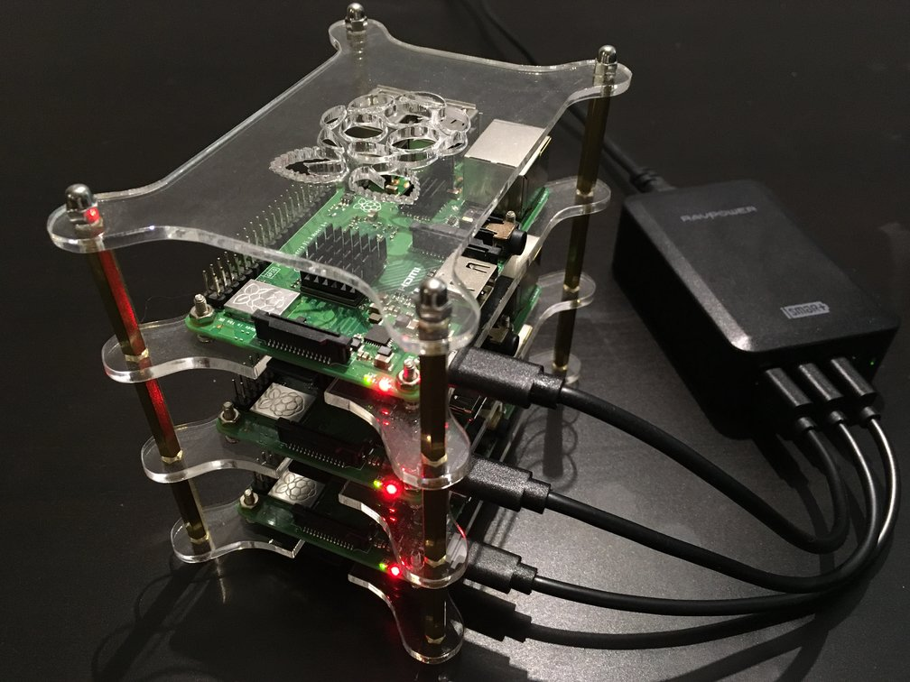

# Kubernetes on Raspberry Pi
The aim of this project is to explore the installation process of Kubernetes, understand its components and how 
they interact together. The setup is based on the official [documentation](https://kubernetes.io/docs/setup/scratch) 
for setting up a cluster from scratch. Moreover, Ansible is used to automate the installation steps. Finally, this setup is intended for testing and experimenting purposes only.



## Requirements
* At least 2 [Raspberry Pi](https://www.raspberrypi.org/products) devices with 
  [Raspbian OS](https://www.raspberrypi.org/downloads/raspbian). <br/>
  (used: Raspberry Pi 3 Model B+ and Raspbian Stretch Lite 2018-11-13)
* The Pis should have ssh enabled with sudo privileges, better with key based authentication. ([guide](https://www.raspberrypi.org/documentation/remote-access/ssh/))  
  PS: a convenience script `install-os.sh` is added to simplify the OS installation to the SD card. It also configures the hostname, copies the WiFi network credentials to the card, configures SSH authorized access keys (and disables default password authentication in this case!), 
* A control machine that has Ansible installed. (used version 2.7.0, [guide](https://docs.ansible.com/ansible/2.7/installation_guide/intro_installation.html))

## Steps
* Clone the repo, navigate to the clone directory and execute `get-binaries.sh`. This will compile/download the required binaries.
* Modify `hosts.yml`, and add there the hostnames of the Pis (names used in this setup are pi1, pi2 and pi3).
* Run the base playbook with Ansible: <br/>
    ```bash
    ansible-playbook -i hosts.yml playbook-base.yml
    ```
* Restart the Pis.
* Check the status of the cluster nodes and pods: <br/>
    ```bash
    pi@pi1:~ $ kubectl get nodes
    NAME   STATUS   ROLES    AGE   VERSION
    pi1    Ready    <none>   74m   v1.13.4
    pi2    Ready    <none>   74m   v1.13.4
    pi3    Ready    <none>   74m   v1.13.4
    pi4    Ready    <none>   74m   v1.13.4
    ```
    ```bash
    pi@pi1:~ $ kubectl get pods
    NAME                          READY   STATUS    RESTARTS   AGE
    kube-apiserver-pi1            1/1     Running   1          75m
    kube-controller-manager-pi1   1/1     Running   2          75m
    kube-scheduler-pi1            1/1     Running   1          75m
    ```
* Optional: run the addons playbook: <br/>
    ```bash
    ansible-playbook -i hosts.yml playbook-addons.yml
    ```